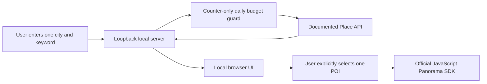

# Architecture

## Trust boundaries

- The Python server binds only to `127.0.0.1`. It accepts a fixed set of static files and same-origin JSON endpoints only.
- `OfficialPlaceClient` owns the Server AK and sends it only to the fixed documented Place API endpoint. Calls are serialized and not retried automatically.
- The Browser AK is deliberately supplied to the browser because that is how JavaScript APIs work. Referer restrictions are its authorization boundary.
- The official JavaScript SDK dynamically evaluates modules and applies inline styles. The CSP allows only those two compatibility exceptions; inline JavaScript and plain-HTTP script sources remain blocked.
- The browser asks the local server for a panorama budget permit only after a user selects a POI. The official SDK resolves and displays the panorama in memory; the app never renders or persists the returned panorama ID.

## Data lifecycle

The server returns the current page of official place display data to the browser and does not write it to disk. The only persistent local file is `usage.json`, containing the date and two integer counters. See [data-provenance.md](data-provenance.md).
